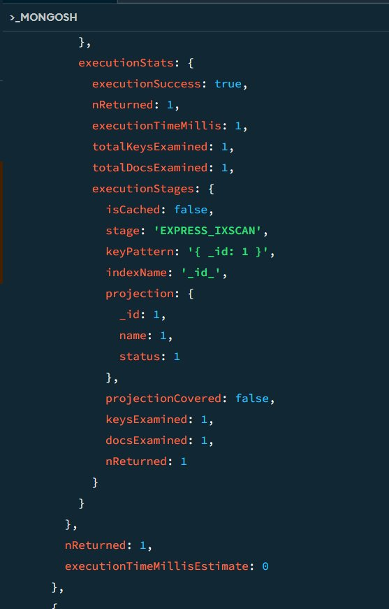
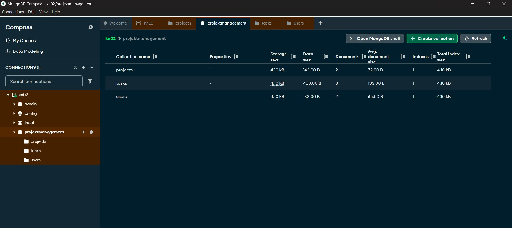
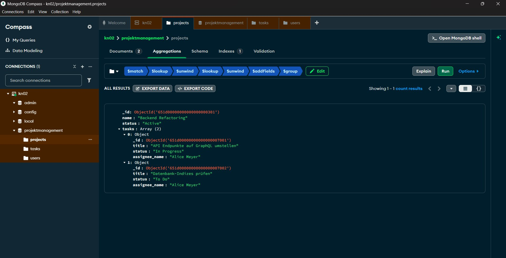

# KN02 / MongoDB: From Relational Thinking to Document Design
**Group D / Das Projektmanagement-Tool**

---

## Phase 1: Grundlagen (40%)

MongoDB was installed locally and MongoDB Compass was used to connect to the local instance at `localhost:27017`.

**Screenshot: Compass connected to local MongoDB instance**


**Screenshot: Database `projektmanagement` with all 3 collections**



---

## Phase 2: The Relational Heritage (10%)

### Setup

Three separate collections were created in the `projektmanagement` database and populated with the provided dummy data:

- `projects` — 2 documents
- `users` — 2 documents
- `tasks` — 3 documents

### Aggregation Pipeline Code

```javascript
db.projects.aggregate([
  { $match: { _id: ObjectId("651d00000000000000000301") } },
  { $lookup: { from: "tasks", localField: "_id", foreignField: "project_id", as: "tasks" } },
  { $unwind: "$tasks" },
  { $lookup: { from: "users", localField: "tasks.assignee_id", foreignField: "_id", as: "tasks.assignee" } },
  { $unwind: "$tasks.assignee" },
  { $addFields: { "tasks.assignee_name": "$tasks.assignee.name" } },
  { $group: {
    _id: "$_id",
    name: { $first: "$name" },
    status: { $first: "$status" },
    tasks: { $push: {
      _id: "$tasks._id",
      title: "$tasks.title",
      status: "$tasks.status",
      assignee_name: "$tasks.assignee_name"
    }}
  }}
])
```

### Explanation

The pipeline starts by filtering down to a single project using `$match`. It then performs two `$lookup` stages: the first joins the project with all its related tasks from the `tasks` collection using the `project_id` field, and the second joins each task with its assigned user from the `users` collection using the `assignee_id` field. An `$addFields` stage extracts the user's name directly onto the task object, and a final `$group` stage reassembles everything back into a single project document containing an array of enriched tasks — each showing the assignee's name.

### Proof: Pipeline Result



---

## Phase 3: Performance Analysis (20%)

### explain() Query

```javascript
db.projects.explain("executionStats").aggregate([
  { $match: { _id: ObjectId("651d00000000000000000301") } },
  { $lookup: { from: "tasks", localField: "_id", foreignField: "project_id", as: "tasks" } },
  { $unwind: "$tasks" },
  { $lookup: { from: "users", localField: "tasks.assignee_id", foreignField: "_id", as: "tasks.assignee" } },
  { $unwind: "$tasks.assignee" },
  { $addFields: { "tasks.assignee_name": "$tasks.assignee.name" } },
  { $group: {
    _id: "$_id",
    name: { $first: "$name" },
    status: { $first: "$status" },
    tasks: { $push: {
      _id: "$tasks._id",
      title: "$tasks.title",
      status: "$tasks.status",
      assignee_name: "$tasks.assignee_name"
    }}
  }}
])
```

### Metrics

| Metric | Value |
|--------|-------|
| `totalDocsExamined` | 6 |
| `nReturned` | 1 |
| `executionTimeMillis` | 1 |

### Proof: explain() Output



### Conclusion

The relational design creates a bottleneck because MongoDB had no index on the `project_id` field in the tasks collection, forcing it to perform 2 full collection scans (`collectionScans: 2`) to complete the `$lookup`. With only 3 tasks in the database, MongoDB still had to examine 6 documents across multiple stages. As the dataset grows — for example to 10,000 tasks — MongoDB would need to scan all 10,000 documents for every single query, since there is no index to narrow the search. The number of documents examined grows linearly with the data size, which makes this design increasingly slow and inefficient at scale.

---

## Phase 4: The Paradigm Shift – New Design (20%)

### New JSON Structure

```json
{
  "_id": { "$oid": "651d00000000000000000301" },
  "name": "Backend Refactoring",
  "status": "Active",
  "tasks": [
    {
      "_id": { "$oid": "651d00000000000000007001" },
      "title": "API Endpunkte auf GraphQL umstellen",
      "status": "In Progress",
      "assignee": {
        "name": "Alice Meyer",
        "role": "Backend Dev"
      }
    },
    {
      "_id": { "$oid": "651d00000000000000007002" },
      "title": "Datenbank-Indizes prüfen",
      "status": "To Do",
      "assignee": {
        "name": "Alice Meyer",
        "role": "Backend Dev"
      }
    }
  ]
}
```

### Justification

In the new design, tasks are **embedded** directly inside the project document rather than stored in a separate collection. This decision is justified by the **1-to-Few relationship** between a project and its tasks — a typical project has a manageable number of tasks, not millions, making embedding efficient and practical.

The **read-to-write ratio** for this use case is heavily skewed towards reads: a project dashboard is loaded frequently, while tasks are created or updated far less often. Following MongoDB's core principle — *"Data that is accessed together should be stored together"* — embedding tasks eliminates the need for any `$lookup` joins at query time.

The assignee information (name and role) is **denormalized** directly onto each task. Although this duplicates user data across documents, it is justified because the primary goal is fast reads, and user names rarely change. If a name does change, the update cost across a few task documents is acceptable compared to the constant performance gain on every read.

This approach replaces a 7-stage aggregation pipeline with a single `find()` query, reducing both complexity and execution time dramatically.

---

## Phase 5: The Proof (10%)

### New Collection

A new collection `projects_embedded` was created with 3 full documents using the embedded design from Phase 4.

### find() Query

```javascript
db.projects_embedded.find(
  { _id: ObjectId("651d00000000000000000301") }
)
```

### explain() on New Query

```javascript
db.projects_embedded.explain("executionStats").find(
  { _id: ObjectId("651d00000000000000000301") }
)
```

### New Metrics

| Metric | Phase 3 (old) | Phase 5 (new) |
|--------|--------------|---------------|
| `totalDocsExamined` | 6 | 1 |
| `nReturned` | 1 | 1 |
| `executionTimeMillis` | 1 | 0 |

### Proof: New explain() Output

*(Screenshot taken from mongosh — same output as pasted below)*

```
executionStats: {
  executionSuccess: true,
  nReturned: 1,
  executionTimeMillis: 0,
  totalKeysExamined: 1,
  totalDocsExamined: 1,
  ...
}
```

### Comparison

In Phase 3, MongoDB had to examine 6 documents across multiple collections and perform 2 full collection scans, taking 1ms — even with only 3 tasks in the database. With the new embedded design, only 1 document is examined and the query completes in 0ms, because MongoDB can use the existing `_id` index to jump directly to the correct document. The redesign clearly paid off: a complex 7-stage aggregation pipeline with joins has been replaced by a single `find()` that runs in constant time, regardless of how many tasks a project contains.
