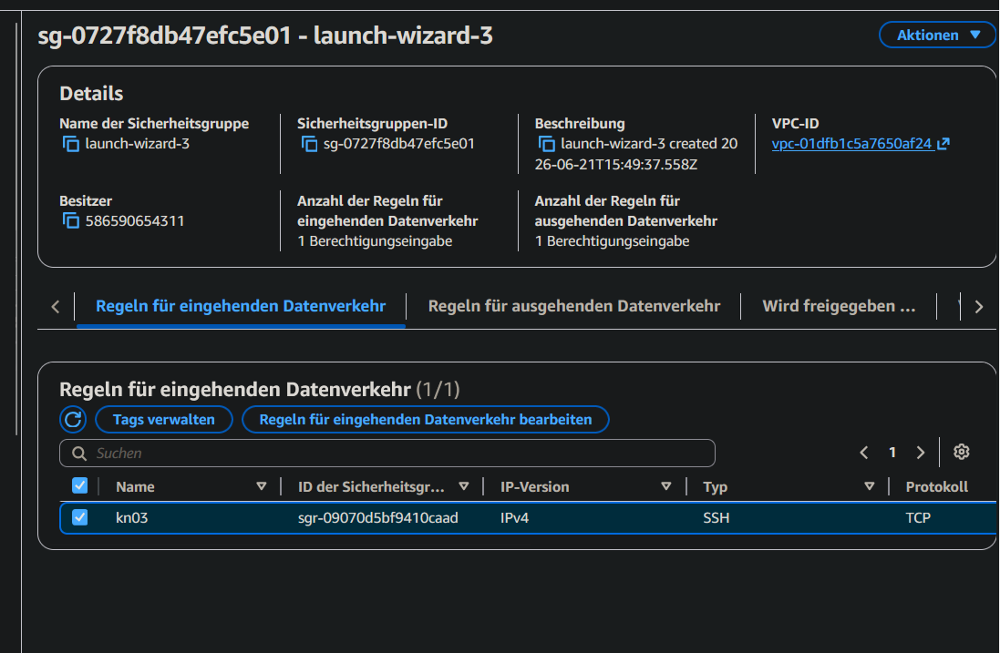
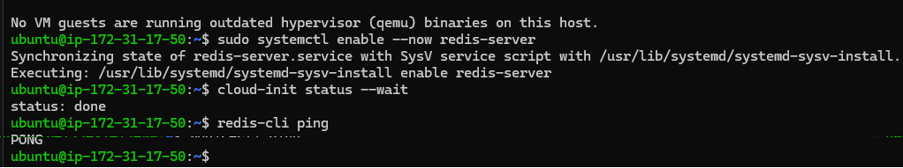
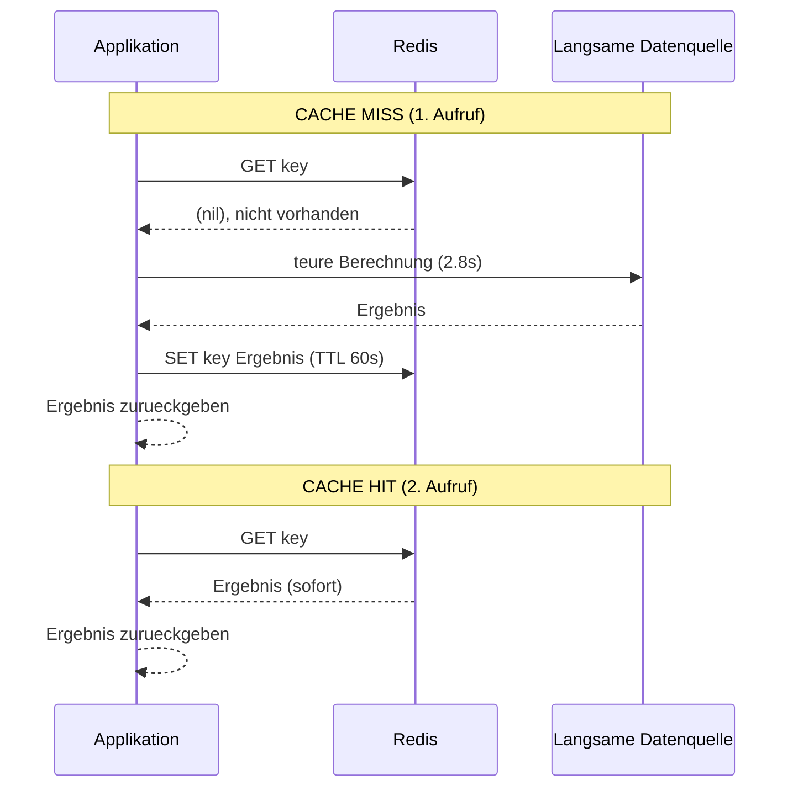
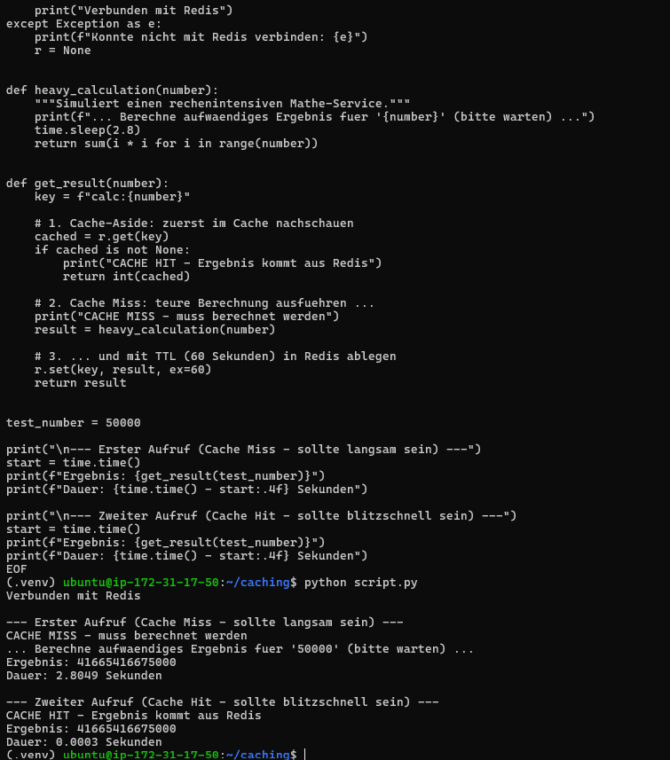
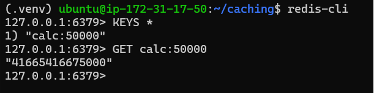
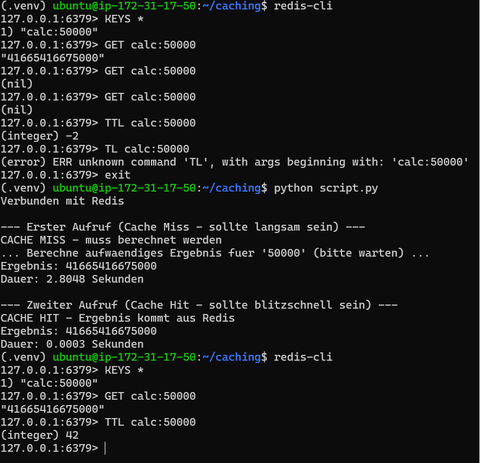

# Lernjournal KN03: Redis, In-Memory und Caching-Strategien

**Module:** KN03 Redis (In-Memory and Caching Strategies)
**Scenario:** B, Rechenintensiver Mathe-Service (compute-heavy math service)
**Environment:** AWS EC2, Ubuntu 24.04, Redis, Python

---

## What this module is about

A normal database, or a slow service like the one in this scenario, has to do the full expensive work on every single request. Redis is an in-memory key-value store. It keeps recent results in RAM, so reading them back later is almost instant.

The goal of this module is to put Redis in front of a slow function, measure how much faster it gets, and then deal with the problem of cached data becoming outdated.

### The idea in one picture

- The slow math service is like a librarian who walks to a back archive on every request. Always correct, but slow (about 2.8 seconds per trip).
- Redis is a small shelf at the front desk that holds copies of recent results. Reading from it is near instant, because it lives in RAM.
- The rule (called Cache-Aside) is: check the front shelf first. If the result is there, return it. If not, do the slow work once, and also put a copy on the shelf so the next request is instant.

---

## Phase 1: Infrastructure and the bottleneck

### What I did

1. Launched a single Ubuntu 24.04 EC2 instance.
2. Set the Security Group so that port 22 (SSH) is reachable from my IP. Port 6379 (Redis) was not opened to the internet. The Python script and Redis run on the same server, so they talk to each other locally and Redis never needs to be exposed.
3. Installed Redis and created the Python script for Scenario B.
4. Connected over SSH and ran the script with no caching yet.

### Result

Both the first and the second call took about 2.8 seconds. Nothing was cached, so even repeating the exact same request was just as slow as the first time. This is the bottleneck the rest of the module fixes.

### Security Group (inbound rules)



### Proof that Redis is running

`redis-cli ping` returns `PONG`, which confirms the Redis server is up.



### Why a latency of 2 to 3 seconds per call is a critical problem

A call that blocks for 2 to 3 seconds holds a server worker busy for that whole time. Under load, many users at once use up all the available workers, so new requests pile up in a queue and start to time out. APIs also usually have a sub-second timeout budget, and other services depend on their answers, so a 2 to 3 second delay breaks the whole chain. This is exactly why repeated expensive lookups need a cache.

---

## Phase 2: Implementing the cache (Cache-Aside)

### What Cache-Aside is and how it works

Cache-Aside means the application manages the cache itself, sitting next to the slow data source. On every read it checks Redis first.

- If the value is in Redis (Cache Hit), it returns it immediately.
- If it is not (Cache Miss), it runs the slow function, writes the result into Redis, and then returns it.

Benefit: only data that is actually requested ever gets cached, and if Redis fails, reads still work, just slower. Cost: the very first request is always slow, and cached data can become outdated. The outdated-data problem is handled with a TTL in Phase 4.

### The adjusted Python code

```python
import time
import redis

# KONFIGURATION
try:
    r = redis.Redis(host='localhost', port=6379, decode_responses=True)
    r.ping()
    print("Verbunden mit Redis")
except Exception as e:
    print(f"Konnte nicht mit Redis verbinden: {e}")
    r = None


def heavy_calculation(number):
    """Simuliert einen rechenintensiven Mathe-Service."""
    print(f"... Berechne aufwaendiges Ergebnis fuer '{number}' (bitte warten) ...")
    time.sleep(2.8)
    return sum(i * i for i in range(number))


def get_result(number):
    key = f"calc:{number}"

    # 1. Cache-Aside: zuerst im Cache nachschauen
    cached = r.get(key)
    if cached is not None:
        print("CACHE HIT - Ergebnis kommt aus Redis")
        return int(cached)

    # 2. Cache Miss: teure Berechnung ausfuehren ...
    print("CACHE MISS - muss berechnet werden")
    result = heavy_calculation(number)

    # 3. ... und mit TTL (60 Sekunden) in Redis ablegen
    r.set(key, result, ex=60)
    return result


test_number = 50000

print("\n--- Erster Aufruf (Cache Miss - sollte langsam sein) ---")
start = time.time()
print(f"Ergebnis: {get_result(test_number)}")
print(f"Dauer: {time.time() - start:.4f} Sekunden")

print("\n--- Zweiter Aufruf (Cache Hit - sollte blitzschnell sein) ---")
start = time.time()
print(f"Ergebnis: {get_result(test_number)}")
print(f"Dauer: {time.time() - start:.4f} Sekunden")
```

### Data flow for a Cache Miss and a Cache Hit



---

## Phase 3: Performance comparison

### Measurements

| Call | Source of the result | Duration |
| :--- | :--- | :--- |
| First call (Cache Miss) | heavy_calculation (slow) | 2.8049 s |
| Second call (Cache Hit) | Redis (in-memory) | 0.0003 s |

The second call was roughly 9000 times faster, because the result was read straight from Redis instead of being recomputed.

### Timing of the miss vs the hit



### Reading the stored key back in the Redis CLI

`KEYS *` lists the stored key, and `GET calc:50000` returns the cached value.



---

## Phase 4: Cache Invalidation and TTL strategy

### What happens when the source data changes

If the data changes in the original source while a copy still sits in the cache, the old value keeps being served until it expires or is deleted. This is the cache invalidation problem.

A TTL (Time To Live) is the simplest fix. The key deletes itself after a set number of seconds. In this script the TTL is 60 seconds, set with `r.set(key, result, ex=60)`.

### Short TTL vs long TTL

- A short TTL keeps the data fresh, but causes more Cache Misses. More misses means more load back on the slow source, which reduces the benefit of caching.
- A long TTL is faster and causes fewer misses, but raises the risk of serving outdated data.
- The right TTL depends on how often the data actually changes and how much staleness is acceptable.

### TTL countdown and expiry

In the screenshot, `TTL calc:50000` returns `42`, which means the key still has 42 seconds left to live. Earlier in the same session, after the full 60 seconds had passed, `GET calc:50000` returned `(nil)` and `TTL calc:50000` returned `-2`. Both of those mean the key had expired and Redis removed it automatically.



---

## Summary: what I learned

- Redis stores results in RAM, so reading a cached value is around a thousand times faster than recomputing it.
- The Cache-Aside pattern is simple: check the cache, return on a hit, compute and store on a miss.
- A cache with no expiry will serve stale data. A TTL is a basic, automatic way to keep cached data fresh enough for its use case.