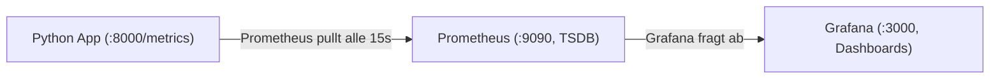
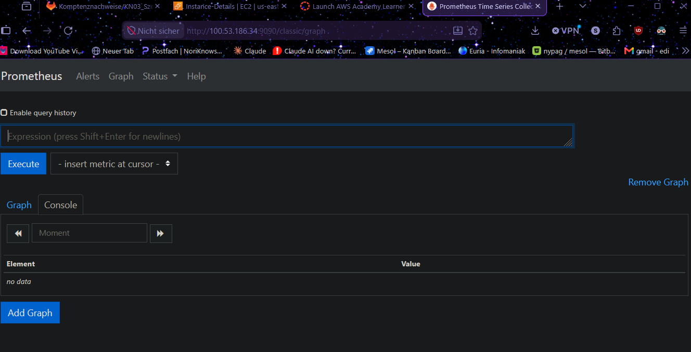
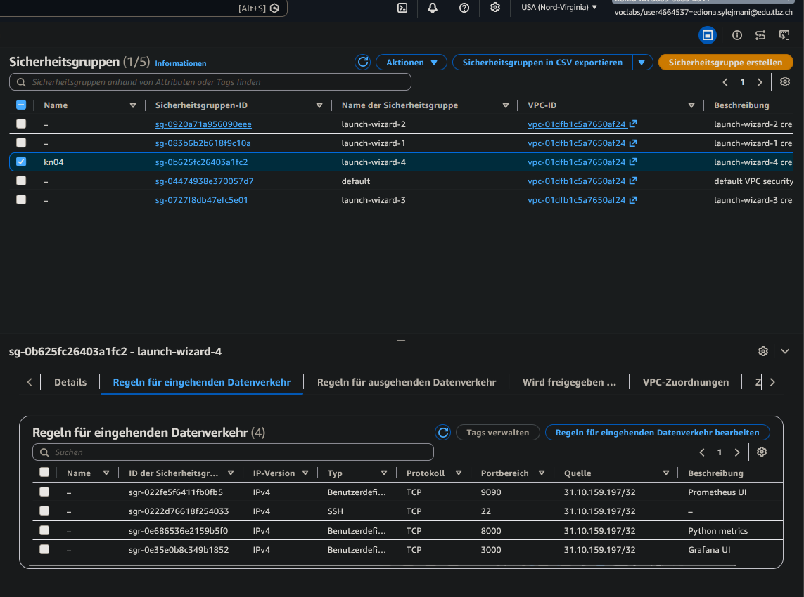
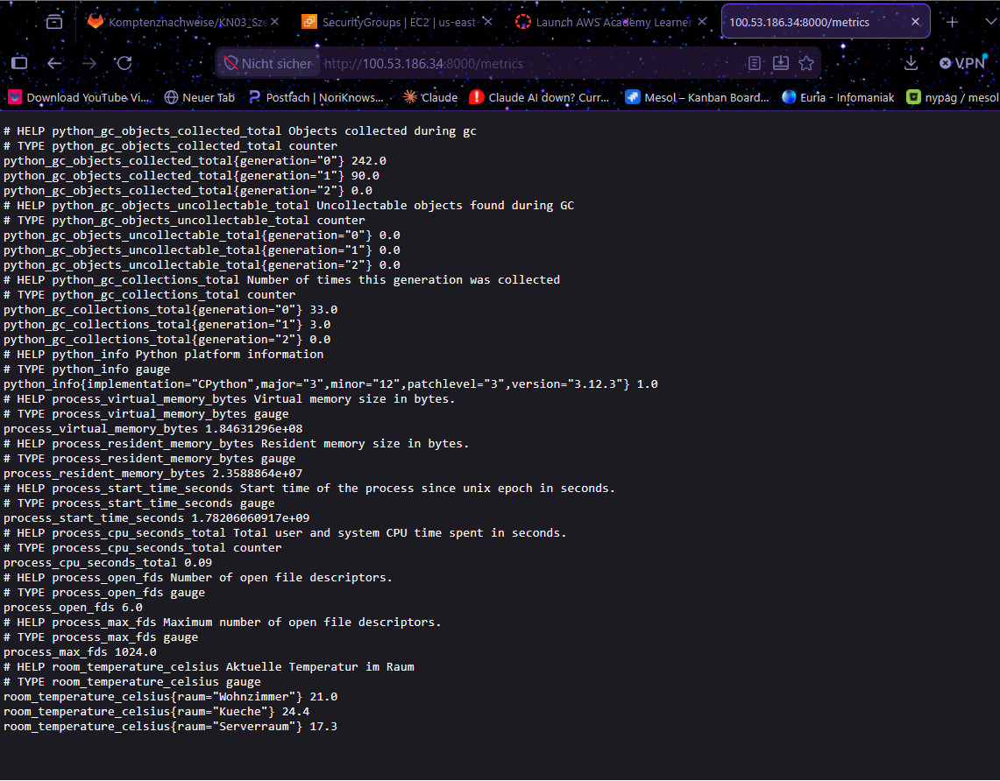
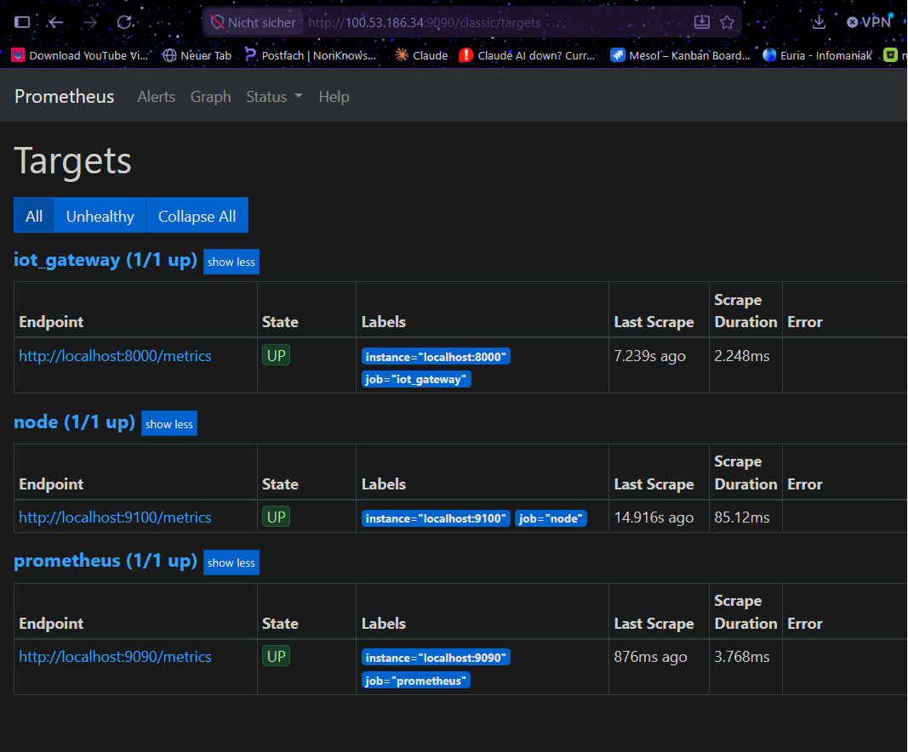
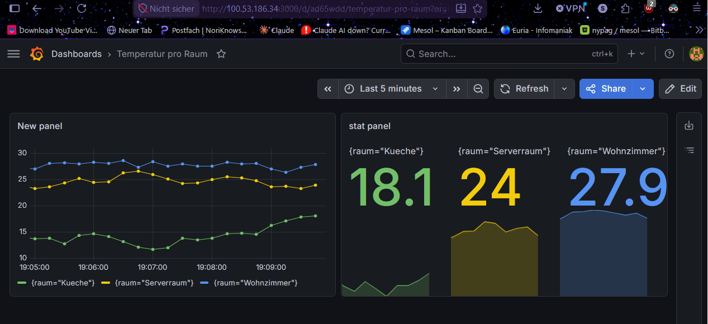
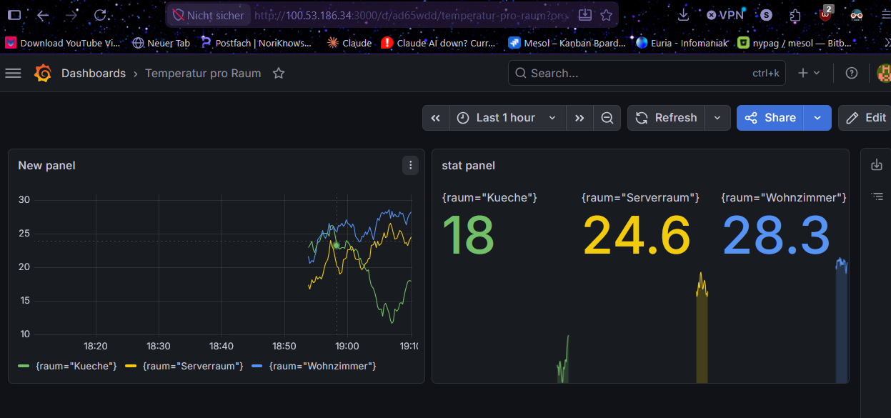

# Lernjournal KN04: Full-Stack Monitoring mit Prometheus & Grafana

**Module:** KN04 (Full-Stack Monitoring)
**Scenario:** D, IoT Temperatur Gateway
**Environment:** AWS EC2, Ubuntu 24.04, Prometheus, Grafana, Python

---

## What this module is about

Instead of one script, this module wires together a three-part monitoring pipeline:



The Python app exposes live numbers at `/metrics`. Prometheus **pulls** those numbers on a timer and stores them as a time-series (each value gets a timestamp). Grafana then draws dashboards from Prometheus.

The key detail is the **pull model**: Prometheus reaches out to the app on a schedule, the app never pushes. This is also why the code never sets a timestamp itself (more on that in Phase 5).

The problem this solves is "Blindflug" (flying blind): watching terminal logs by hand does not scale, so you need metrics that are stored, searchable, and graphable.

---

## Phase 1: Infrastructure and the Blindflug problem

### What I did

1. Launched a single Ubuntu 24.04 EC2 instance.
2. Set the Security Group so four ports are reachable from my IP: 22 (SSH), 9090 (Prometheus), 3000 (Grafana), 8000 (Python metrics).
3. Provisioned the instance so Prometheus, Grafana, and the Python tooling were installed, and dropped in the Scenario D script.
4. Connected over SSH and ran the script before adding any metrics code.

### Result

The script only printed sensor readings to the terminal every 2 seconds. That is the Blindflug: the data scrolls past and is gone, nothing is stored, nothing can be searched or graphed.

### Prometheus homepage

Prometheus is reachable on port 9090.



### Security Group (inbound rules)

The four required ports, each scoped to my IP.



### What makes a Time-Series Database (TSDB) different from a relational database

A TSDB is built to store data points that each carry a timestamp, optimized for writing huge streams of time-stamped values and querying them over time ranges. A relational database organizes data into related tables of rows and columns and is optimized for exact lookups and joins, not for millions of timestamped samples per metric.

### Why relying on terminal logs to monitor errors is a bad idea at scale

Logs scroll past in real time and disappear once the terminal closes, so there is no history to look back on. With hundreds of servers nobody can watch hundreds of terminals, and you cannot search, count, or graph across them. Metrics stored in a TSDB are kept over time, can be queried and alerted on automatically, and scale to many machines without a human watching each one.

---

## Phase 2: Instrumentation (code)

### What I did

I filled in the four missing pieces so the app exposes its data to Prometheus:

1. Imported `start_http_server` and `Gauge` from `prometheus_client`.
2. Created the metric as a `Gauge` with the label `raum`.
3. Updated the metric for each room inside the loop.
4. Started the metrics server on port 8000.

A `Gauge` is the right type here because a temperature can go **up and down**, unlike a `Counter` which only ever increases (for example a request count). The label `raum` lets one metric hold a separate value per room.

### The adjusted Python code

```python
import time
import random
from prometheus_client import start_http_server, Gauge

# Gauge: misst einen aktuellen Wert, der hoch und runter gehen kann.
# Das Label 'raum' trennt die Werte pro Raum.
temp_metric = Gauge('room_temperature_celsius', 'Aktuelle Temperatur im Raum', ['raum'])

temperatures = {'Wohnzimmer': 21.0, 'Kueche': 23.5, 'Serverraum': 18.0}

def read_sensors():
    for room in temperatures.keys():
        change = random.uniform(-0.5, 0.5)
        temperatures[room] = round(temperatures[room] + change, 1)
        print(f"[SENSOR] {room}: {temperatures[room]} °C")
        # Aktuellen Wert auf die Metrik fuer diesen Raum setzen
        temp_metric.labels(raum=room).set(temperatures[room])

if __name__ == '__main__':
    print("Starte IoT Temperatur Gateway...")
    # Metrik-Server starten: stellt die Werte unter :8000/metrics bereit
    start_http_server(8000)
    while True:
        read_sensors()
        print("-" * 20)
        time.sleep(2.0)
```

### The metrics endpoint

With the server running, the app exposes its metrics at `http://<Public-IP>:8000/metrics`. Near the bottom of the output you can see the custom metric, one line per room thanks to the label.



---

## Phase 3: Prometheus configuration and scraping

### What I did

Prometheus does not know about the app until it is told. I added a scrape job to `/etc/prometheus/prometheus.yml` pointing at `localhost:8000`, restarted Prometheus, and confirmed the target was healthy.

```yaml
  - job_name: 'iot_gateway'
    static_configs:
      - targets: ['localhost:8000']
```

The target is `localhost:8000` because the app and Prometheus run on the same server, so they reach each other locally.

### Targets page

On the "Status, Targets" page the `iot_gateway` job shows **UP**, which means Prometheus is successfully scraping the app.



---

## Phase 4: Grafana visualization

### What I did

1. Logged in to Grafana on port 3000.
2. Added Prometheus as a data source with the URL `http://localhost:9090` (same server, so localhost again).
3. Built a dashboard with two panels, both querying `room_temperature_celsius`:
   - A Time series panel showing one line per room.
   - A Stat panel showing the current temperature per room as large numbers.
4. Took the same dashboard at two different time ranges.

### Last 5 minutes

Short range: each data point is drawn individually, so the lines look detailed and jagged.



### Last 1 hour

Long range: many more points are packed into the same width, so the lines look smoother and denser.



### What happens to the graph at a large time range vs a short one

On a very large time range, Grafana has to fit far more data points into the same pixel width, so it averages them together. The line looks smoother and flatter and short spikes get hidden. On a short range each point is drawn on its own, so the line looks more detailed and jagged.

---

## Phase 5: Architecture reflection

### Why the Target URL and the Data Source URL are both `localhost`

Prometheus, Grafana, and the Python app all run on the same EC2 instance. When Prometheus scrapes the app or Grafana queries Prometheus, that traffic never leaves the server, so each service reaches the other at `localhost`. The public IP is only needed by me, coming from outside over the internet. Inside the box, `localhost` is correct and avoids a pointless round trip out and back.

### The advantage of the dimensional (label) data model over SQL tables

One metric (`room_temperature_celsius`) holds many series, separated by label value (`raum="Wohnzimmer"`, `raum="Kueche"`, and so on), so there is no need for a separate table or metric per room. For analysis you can query the whole metric at once, filter to a single room with a label, or aggregate across all rooms (for example an average), all using the same metric name. Adding a new room needs no schema change, it simply appears as a new label value.

### The timestamp magic: how Prometheus knows when an event happened

My code only sets the current value of each metric, it never records the time. Prometheus works on a pull model: it reaches out to the app's `/metrics` endpoint on a fixed schedule (about every 15 seconds) and reads the current values. At the moment it scrapes, Prometheus stamps each value with the scrape time. So the timestamp comes from Prometheus, not from the app, and the time axis of the graph is built from these scrape times. That is why the code never needs `time.now()`.

---

## Summary: what I learned

- A monitoring stack has three roles: the app produces metrics, Prometheus pulls and stores them as a time-series, and Grafana visualizes them.
- The pull model means the app just exposes its current numbers, and Prometheus supplies the timestamps when it scrapes.
- Labels turn one metric into many series, which is far more flexible than one table per category.
- A large time range in Grafana aggregates points and smooths the line, while a short range shows full detail.