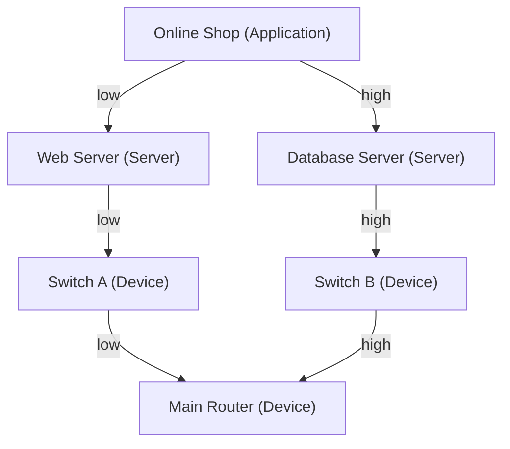
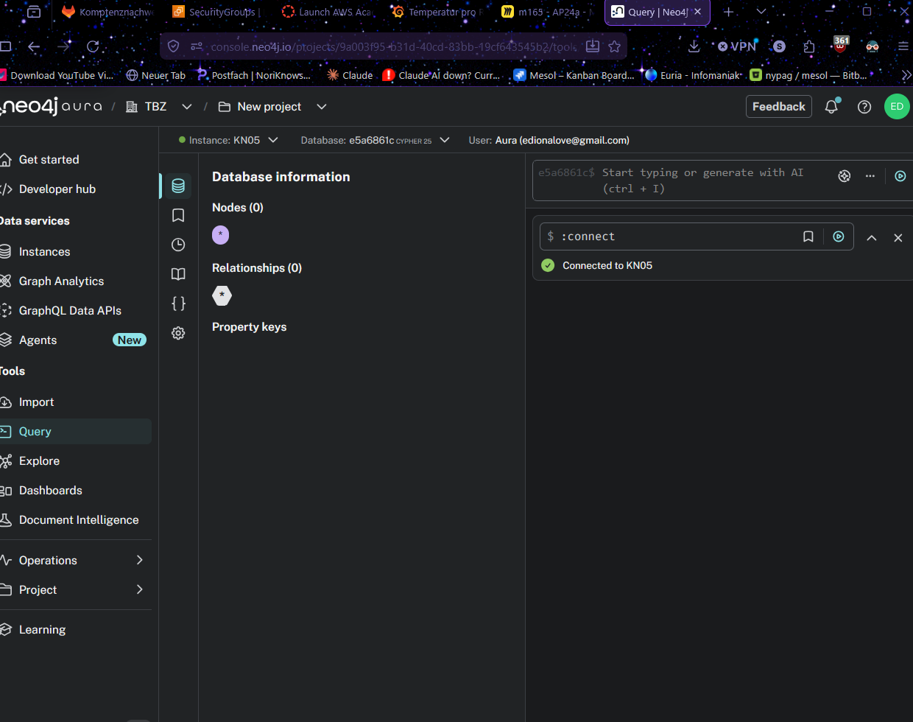
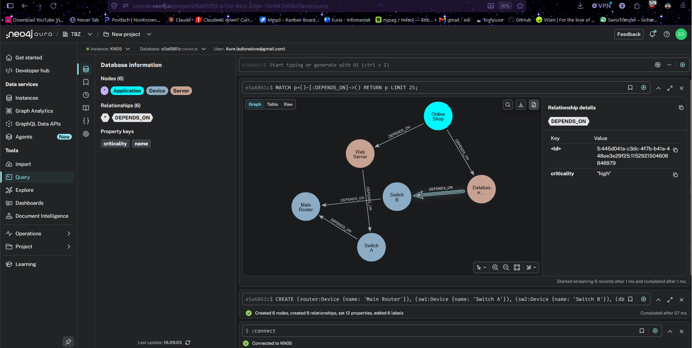
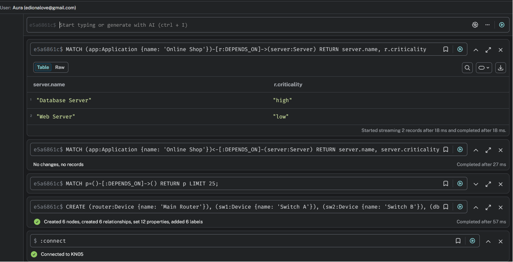

# Lernjournal KN05: Graphdatenbanken & Vernetzte Daten mit Neo4j

**Module:** KN05 (Graph databases)
**Scenario:** D, IT-Netzwerk Topologie (Impact Analysis)
**Environment:** Neo4j AuraDB Free (cloud), Cypher

---

## What this module is about

Neo4j is a graph database. Instead of tables it stores three things:

- **Nodes**: the things (a router, a server, an application).
- **Relationships**: the arrows between things (one device depends on another).
- **Properties**: data on either a node or a relationship.

The key idea of this module is that a property can sit directly **on a relationship**. "This dependency is high criticality" lives on the arrow itself. In SQL the same thing needs a separate mapping table, in Neo4j it is just an attribute on the edge.

### The Scenario D topology



Every arrow is a `DEPENDS_ON` relationship with a `criticality` property. The database path (right side) is `high` because the database has no backup, the web path (left side) is `low` because the web server is redundant.

---

## Phase 1: Cloud setup and Neo4j Workspace

### What I did

1. Created a free Neo4j AuraDB cloud instance (named KN05) at console.neo4j.io.
2. Saved the generated database password.
3. Opened the Workspace Query editor and connected to the instance.

### Workspace connected to the cloud database



---

## Phase 2: Relationship properties (edge attributes)

### What I did

The nodes were already defined. I added the six `DEPENDS_ON` relationships, each carrying a `criticality` property. The syntax to learn is that the property goes in curly braces directly on the relationship: `-[:DEPENDS_ON {criticality: 'high'}]->`.

### The complete CREATE code

```cypher
CREATE 
  (router:Device {name: 'Main Router'}),
  (sw1:Device {name: 'Switch A'}),
  (sw2:Device {name: 'Switch B'}),
  (db:Server {name: 'Database Server'}),
  (web:Server {name: 'Web Server'}),
  (app:Application {name: 'Online Shop'}),
  (app)-[:DEPENDS_ON {criticality: 'low'}]->(web),
  (app)-[:DEPENDS_ON {criticality: 'high'}]->(db),
  (web)-[:DEPENDS_ON {criticality: 'low'}]->(sw1),
  (db)-[:DEPENDS_ON {criticality: 'high'}]->(sw2),
  (sw1)-[:DEPENDS_ON {criticality: 'low'}]->(router),
  (sw2)-[:DEPENDS_ON {criticality: 'high'}]->(router)
```

Viewing the result with `MATCH (n) RETURN n` draws the graph. Clicking a `DEPENDS_ON` arrow opens a details panel showing its `criticality` value.

### Graph with an edge attribute visible



---

## Phase 3: The "Broken AI" query (debugging)

### The broken query

```cypher
MATCH (app:Application {name: 'Online Shop'})<-[:DEPENDS_ON]-(server:Server)
RETURN server.name, server.criticality
```

Running it returns zero records.

### What was logically wrong

The arrow pointed the wrong way: the query asked for servers that depend on the Online Shop, but in the graph the Online Shop depends on the servers, so nothing matched. On top of that it read `criticality` from the server node, but that property lives on the `DEPENDS_ON` relationship, not on the node.

### The fixed query

```cypher
MATCH (app:Application {name: 'Online Shop'})-[r:DEPENDS_ON]->(server:Server)
RETURN server.name, r.criticality
```

The arrow now points from the app to the servers, and `criticality` is read from the relationship `r`. The result is two rows: Database Server / high and Web Server / low.

### The correct result



---

## Phase 4: Architecture reflection

### How a classic SQL database would store the same edge attributes

You would need two tables. A `devices` table with `id` as PRIMARY KEY plus `name` and `type` columns to hold the nodes. Then a `dependencies` junction table with `source_id` and `target_id`, both FOREIGN KEYs pointing back to `devices.id`, plus a `criticality` column. The composite `(source_id, target_id)` would be the primary key. The criticality attribute has to live as a column on that junction table, because SQL cannot attach data to a relationship directly. That junction table is exactly the mapping table that Neo4j lets you avoid.

### Why deep queries are slow in SQL but fast in Neo4j (recursive JOINs vs Index-Free Adjacency)

In SQL, following dependencies several hops deep means joining the dependencies table to itself once per hop, or using a recursive CTE. Every hop is another lookup across the whole table through its index, so a 4-hop query performs four expanding rounds of index lookups, and the cost grows quickly as the table gets larger.

Neo4j uses Index-Free Adjacency: each node stores direct pointers to its neighbouring nodes and relationships. Traversing means following those pointers straight from one node to the next. A 4-hop query simply follows four pointers out from the start node, and the cost depends only on how many relationships you actually walk, not on the total size of the database. That is why deep traversals answer in milliseconds in Neo4j.

---

## Summary: what I learned

- A graph database stores nodes, relationships, and properties, and properties can sit directly on a relationship.
- An attribute on an edge (here `criticality`) replaces an entire junction table in SQL.
- In Cypher, arrow direction is part of the pattern, so a reversed arrow returns nothing, and edge properties must be read from the relationship variable, not the node.
- Neo4j stays fast on deep traversals because it follows direct pointers between nodes instead of doing repeated index lookups like SQL JOINs.