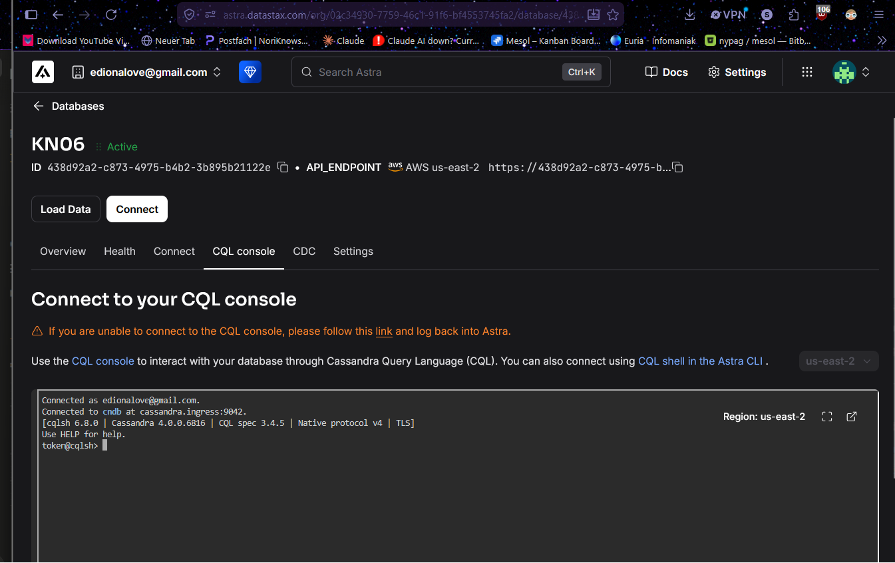
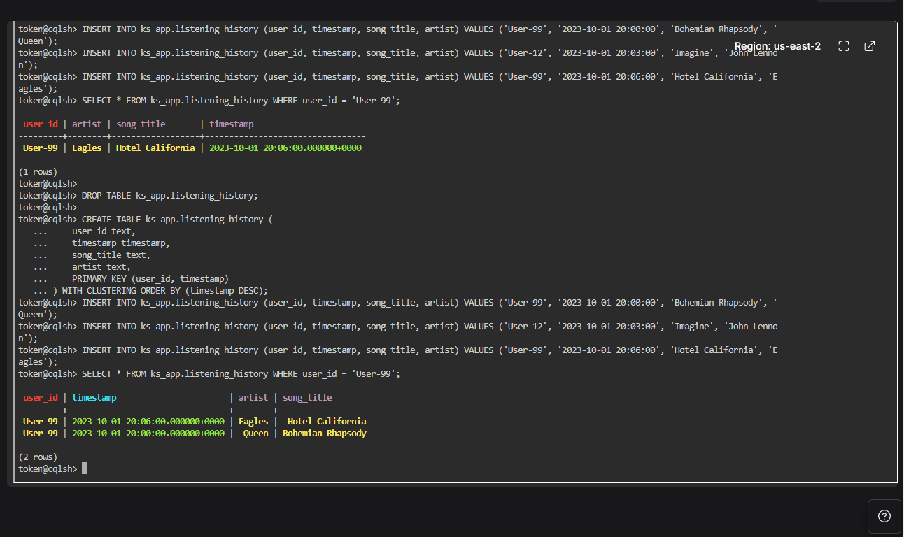

# Lernjournal KN06: Wide-Column Stores & Query-First Design mit Cassandra

**Module:** KN06 (Wide-Column Stores)
**Scenario:** E, Musik-Streaming (Listening History)
**Environment:** DataStax Astra DB (cloud Cassandra), CQL

---

## What this module is about

Cassandra is a wide-column store, built for massive write loads and time-series data, and it is an AP system (it favours availability and partition tolerance). CQL looks almost exactly like SQL, but the data model underneath behaves completely differently. Two concepts drive everything:

- **Partition Key**: decides which node stores a row. It is hashed to distribute data across the cluster (sharding), and queries must target it to be fast.
- **Clustering Column**: decides the sort order of rows within a single partition, and makes each row unique inside that partition.

The golden rule is **Query-First Design**: model the table for the query you need, not around relationships like in SQL.

For this scenario the goal is a user profile page showing a user's listening history, so the query is "give me all songs for one user, newest first".

---

## Phase 1: Cloud setup and CQL Console

### What I did

1. Created a free DataStax Astra DB serverless database (KN06).
2. Used the existing `ks_app` keyspace.
3. Opened the in-browser CQL Console, which connected automatically to the database.

### CQL Console connected



---

## Phase 2: The broken AI table

> Note: in this scenario the broken query does **not** throw a red error. It runs fine but returns the wrong result, because the table was modelled like an SQL table.

### What I did

The AI used `PRIMARY KEY (user_id)` with no clustering column. I ran the create, the three inserts (two of them for User-99), and the query that should show User-99's history.

```sql
CREATE TABLE ks_app.listening_history (
    user_id text,
    timestamp timestamp,
    song_title text,
    artist text,
    PRIMARY KEY (user_id)
);

INSERT INTO ks_app.listening_history (user_id, timestamp, song_title, artist) VALUES ('User-99', '2023-10-01 20:00:00', 'Bohemian Rhapsody', 'Queen');
INSERT INTO ks_app.listening_history (user_id, timestamp, song_title, artist) VALUES ('User-12', '2023-10-01 20:03:00', 'Imagine', 'John Lennon');
INSERT INTO ks_app.listening_history (user_id, timestamp, song_title, artist) VALUES ('User-99', '2023-10-01 20:06:00', 'Hotel California', 'Eagles');

SELECT * FROM ks_app.listening_history WHERE user_id = 'User-99';
```

### The wrong result

Only one row comes back. Queen is gone:

```
 user_id | artist | song_title       | timestamp
---------+--------+------------------+---------------------------------
 User-99 | Eagles | Hotel California | 2023-10-01 20:06:00.000000+0000
(1 rows)
```

(Visible at the top of the Phase 2 and 3 console capture below.)

### Why the result is wrong

With `PRIMARY KEY (user_id)`, `user_id` is the only key and there is no clustering column, so each `user_id` can hold exactly one row. In Cassandra an `INSERT` with an existing primary key is an upsert, so the second User-99 insert (Eagles) overwrote the first (Queen) instead of adding a new row. The query is correct, the table design is the problem.



---

## Phase 3: Query-First Design (fixing the model)

### Which field is which

- Partition Key: `user_id` (all of a user's history lives together on one node, fast to look up by user).
- Clustering Column: `timestamp` (makes each row in the partition unique, so no more overwrites, and sorts the songs).

### The corrected CREATE TABLE

```sql
DROP TABLE ks_app.listening_history;

CREATE TABLE ks_app.listening_history (
    user_id text,
    timestamp timestamp,
    song_title text,
    artist text,
    PRIMARY KEY (user_id, timestamp)
) WITH CLUSTERING ORDER BY (timestamp DESC);
```

After reloading the same inserts and running the exact same `SELECT`, both songs are kept and sorted newest first:

```
 user_id | timestamp                       | artist | song_title
---------+---------------------------------+--------+-------------------
 User-99 | 2023-10-01 20:06:00.000000+0000 | Eagles | Hotel California
 User-99 | 2023-10-01 20:00:00.000000+0000 | Queen  | Bohemian Rhapsody
(2 rows)
```

The proof that the same query now returns the full history is the two-row result at the bottom of the console capture in Phase 2 above.

---

## Phase 4: Architecture reflection

### Why `ALLOW FILTERING` is an anti-pattern in production

Normally Cassandra uses the partition key to jump straight to the one node that holds the data. `ALLOW FILTERING` tells it to ignore that and scan every partition across every node, reading and discarding rows until it finds matches. On a tiny test table that is instant, but in a large distributed production database (Netflix or Spotify scale) it means contacting every node and scanning billions of rows for a single query, which is extremely slow and can overload the whole cluster. It throws away the exact thing Cassandra is designed for, predictable reads targeted at one partition, which is why it is treated as a deadly anti-pattern.

### Partition Key vs Clustering Column

The partition key decides which node stores a row. It is hashed to route the data to a shard, so it controls how data is distributed and is what a query must target to be efficient. The clustering column decides the sort order of rows within a single partition and, together with the partition key, makes each row unique. Put simply: the partition key is where the data lives, the clustering column is how it is ordered inside that place.

---

## Summary: what I learned

- Cassandra looks like SQL through CQL, but the data model is built around the query, not relationships.
- The partition key controls distribution, the clustering column controls ordering and row uniqueness within a partition.
- A primary key with no clustering column collapses many rows into one, because an `INSERT` with an existing key is an upsert.
- Adding `timestamp` as a clustering column fixed the listening history so each play is its own row, sorted newest first.
- `ALLOW FILTERING` papers over a bad model and destroys performance at scale, so the real fix is always to model the table for the query.