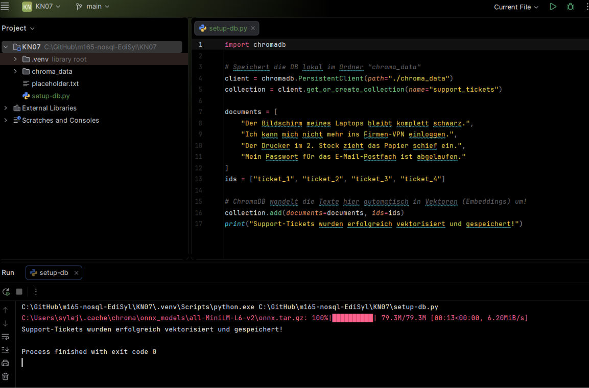
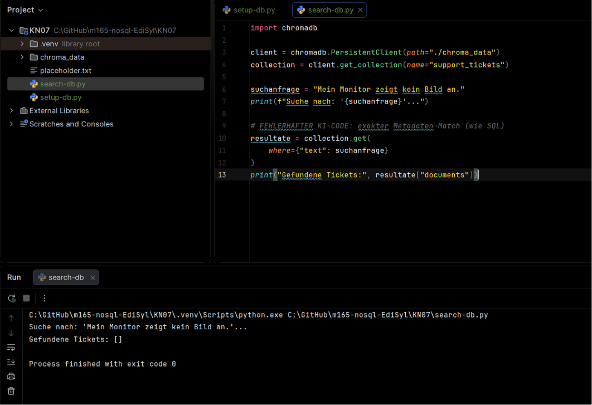
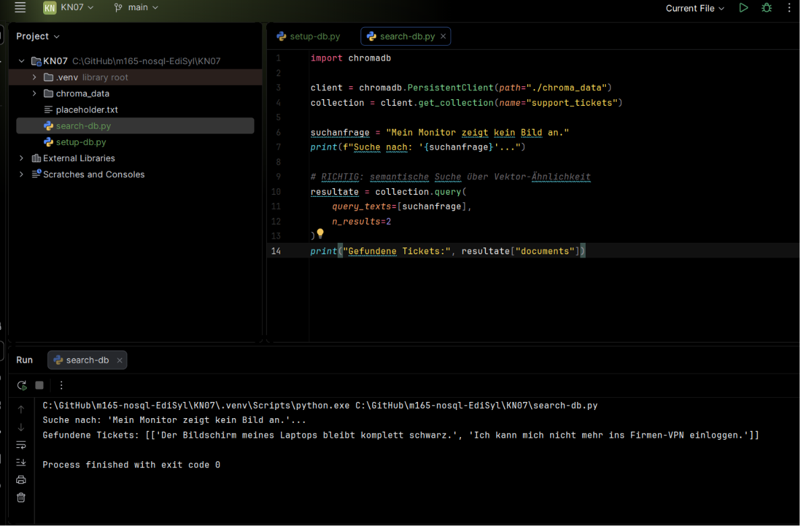

# Lernjournal KN07: Vektordatenbanken & Semantische Suche mit ChromaDB

**Module:** KN07 (Vector databases)
**Scenario:** A, IT-Support (Ticket Matching)
**Environment:** ChromaDB, local Python (PyCharm + virtualenv)

---

## What this module is about

Classic search (SQL `LIKE '%word%'`) matches characters. If a ticket says "Bildschirm" and the user types "Monitor", a character match finds nothing, even though they mean the same thing.

A vector database fixes this. It runs every text through an **embedding model**, a small AI model that turns text into a list of numbers (a vector) that captures its meaning. Texts with similar meaning get similar vectors, so they sit close together in a multi-dimensional space. Searching then means finding the nearest points, not matching letters. That is the difference between **lexical search** (exact keyword or metadata match) and **semantic search** (vector similarity).

This is the same technology behind RAG (Retrieval-Augmented Generation), where a chatbot looks up relevant documents by meaning and feeds them into its answer.

---

## Phase 1: Setup and the embedding

### What I did

1. Created a project with a virtual environment in PyCharm.
2. Installed ChromaDB with `pip install chromadb`.
3. Wrote `setup_db.py`, which stores four support tickets in a local ChromaDB collection.
4. Ran it. On the first run ChromaDB downloaded its embedding model (`all-MiniLM-L6-v2`, about 79 MB), then converted each ticket into a vector and saved everything into a local `chroma_data` folder.

### The setup code

```python
import chromadb

# Speichert die DB lokal im Ordner "chroma_data"
client = chromadb.PersistentClient(path="./chroma_data")
collection = client.get_or_create_collection(name="support_tickets")

documents = [
    "Der Bildschirm meines Laptops bleibt komplett schwarz.",
    "Ich kann mich nicht mehr ins Firmen-VPN einloggen.",
    "Der Drucker im 2. Stock zieht das Papier schief ein.",
    "Mein Passwort fuer das E-Mail-Postfach ist abgelaufen."
]
ids = ["ticket_1", "ticket_2", "ticket_3", "ticket_4"]

# ChromaDB wandelt die Texte hier automatisch in Vektoren (Embeddings) um
collection.add(documents=documents, ids=ids)
print("Support-Tickets wurden erfolgreich vektorisiert und gespeichert!")
```

### What an embedding model is

An embedding model is a small AI model that converts text into a list of numbers (a vector) that represents its meaning. Texts with similar meaning produce vectors that are close together in this numeric space. So when ChromaDB stores a document, it does not just save the text, it also saves this meaning-vector, which is what later allows searching by meaning instead of by exact words.



---

## Phase 2: Lexical vs Semantic search

### The broken AI query

The AI wrote the search using `collection.get(where={...})`, which is an exact metadata filter, the SQL way of thinking.

```python
suchanfrage = "Mein Monitor zeigt kein Bild an."

# FEHLERHAFTER KI-CODE: exakter Metadaten-Match (wie SQL)
resultate = collection.get(
    where={"text": suchanfrage}
)
print("Gefundene Tickets:", resultate["documents"])
```

Running it returns an empty result:

```
Gefundene Tickets: []
```

### Why it returned nothing

`get(where={...})` is a lexical lookup: it filters for documents whose metadata exactly matches a value. The tickets were stored with no metadata field called `text`, and even if they had one, it would need a character-for-character match. The search sentence "Mein Monitor zeigt kein Bild an." is not identical to any stored sentence, so the exact-match filter found nothing. It never looked at the vectors at all, which are the only thing that could have seen the matching meaning.



### The fix

Swapping `get(where=...)` for `query(query_texts=...)` switches from an exact match to a semantic similarity search.

```python
suchanfrage = "Mein Monitor zeigt kein Bild an."

# RICHTIG: semantische Suche ueber Vektor-Aehnlichkeit
resultate = collection.query(
    query_texts=[suchanfrage],
    n_results=2
)
print("Gefundene Tickets:", resultate["documents"])
```

Now ChromaDB turns the search text into a vector and returns the two nearest tickets by meaning. The top hit is the black-screen ticket, even though it shares almost no words with the query:

```
Gefundene Tickets: [['Der Bildschirm meines Laptops bleibt komplett schwarz.',
                     'Ich kann mich nicht mehr ins Firmen-VPN einloggen.']]
```

The first result is the correct semantic match (monitor showing no image equals black screen). The second appears only because `n_results=2` always returns two nearest neighbours.



---

## Phase 3: Architecture reflection

### Why a vector database sees "Hund" and "Welpe" as similar, while SQL cannot

SQL's `LIKE` matches characters. The word "Welpe" does not contain the letters "Hund", so `WHERE text LIKE '%Hund%'` can never match it, no matter how related the meaning is. A vector database instead turns each word into a vector based on its meaning, learned from how words are actually used across huge amounts of text. Because "Hund" and "Welpe" appear in very similar contexts, their vectors land very close together in the vector space. The search measures the distance between vectors, so it finds "Welpe" as a near neighbour of "Hund" even though they share no letters.

### Why semantic search usually needs to be combined with a metadata filter

Semantic search finds the most meaning-similar documents, but it has no concept of hard rules. Suppose each ticket also carries metadata like `{"kategorie": "hardware", "jahr": 2023}`, and you only want hardware tickets from 2023. A pure semantic query might rank a very similar-sounding software ticket from 2021 at the top. By combining `query(query_texts=...)` with a metadata filter `where={"kategorie": "hardware", "jahr": 2023}`, ChromaDB first keeps only the rows that satisfy the exact constraints, then ranks those by semantic similarity. Metadata handles exact facts (category, date, owner, access rights), vectors handle fuzzy meaning, and real applications usually need both at once.

---

## Summary: what I learned

- A vector database stores the meaning of text as a vector, not just the text itself.
- An embedding model is what turns text into those meaning-vectors.
- Lexical search (`get(where=...)`) matches exact values and misses anything worded differently. Semantic search (`query(query_texts=...)`) finds the nearest vectors and matches on meaning.
- That is why a search for "Monitor kein Bild" finds a ticket about a "schwarzer Bildschirm" with no shared keywords.
- In practice you combine semantic search with metadata filters, so meaning and hard facts both apply.
